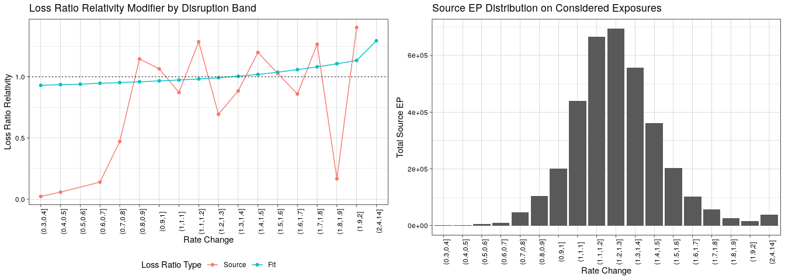
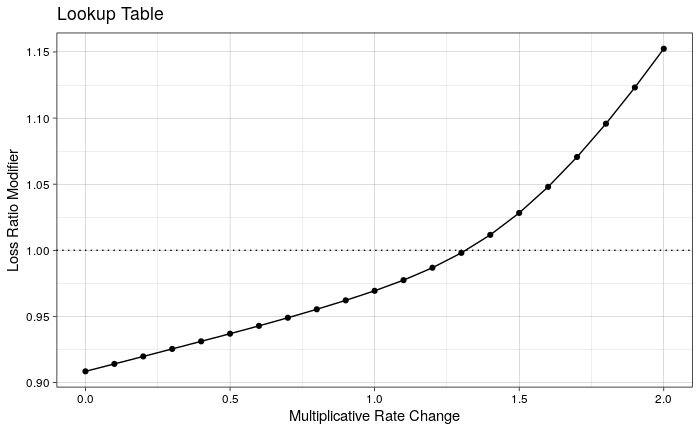

# Rate Capping Worksheet Loss Forecast

### `sql/base_lr.sql`
`sql/base_lr.sql` computes the base loss ratios by tenure that are used in the original version of the worksheet. These are the loss ratios to which the relativities computed in `disruption_LRR.Rmd` are to be applied.

### `disruption_LRR.Rmd`
`disruption_LRR.Rmd` does the following:
1. Reads in the "raw data" tab from the rate capping worksheet (expected to contain finalized `soure_premium` and `target_premium` by `quote_id`).
2. Combines these premia with loss information from `EDW.fact_financials_accumulating`.
3. Fits a monotonic spline (using the [scam](https://cran.r-project.org/web/packages/scam/scam.pdf) package) in a Tweedie GAM using rate change to predict loss ratio.
4. Uses this fit to get a loss ratio relativity that can then be used to segment the forecast loss ratio by premium disruption.
5. Outputs the loss ratio relativity predictions in both a lookup table (visualized in Exhibit B) and by `quote_id`.

#### Parameters

Disruption at the top and bottom of the exhibits is grouped to eliminate small volume bands.

* `MIN_RATE_CHANGE_FOR_CUVE_EXHIBIT` - The lower end of the bottom disruption band in Exhibit A.
* `MAX_RATE_CHANGE_FOR_CUVE_EXHIBIT` - The lower end of the top disruption band in Exhibit A.
* `RATE_CHANGE_GRANULARITY_FOR_EXHIBIT` - Width of disruption bands in Exhibit A.
* `MAX_SOURCE_VALUE` - Max value eligible to be printed on the y-axis of the left graph in Exhibit A.

⚠️ Note: Be careful to set the correct as of date and exposure window (previous year) when pulling data from FFA!

#### Exhibits / Example

The following exhibits are the result of using the "raw data" tab in the Maryland run of original worksheet in Jan. 2022 (`example/md_raw_data.csv`).

###### Exhibit A

###### Exhibit B

